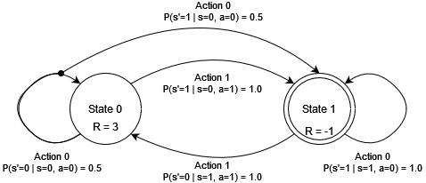
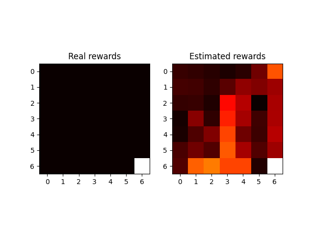
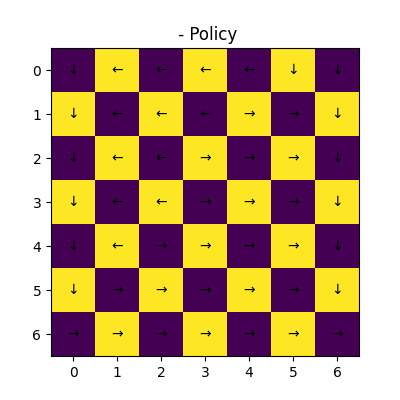
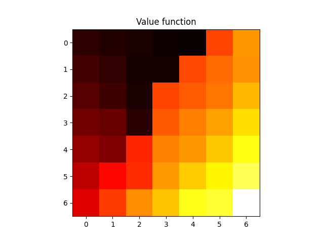

# Maximum Entropy Deep Inverse Reinforcement Learning
This repository contains the implementation of the paper "Maximum Entropy Deep Inverse Reinforcement Learning" by [Wulfmeier et al.](https://arxiv.org/abs/1507.04888) [\[1\]](#references) in PyTorch.

It also contains the implementation of a deterministic value iteration algorithm by [Sutton et Barto](https://mitpress.mit.edu/9780262039246/reinforcement-learning/) [\[2\]](#references) along with a `gymnasium` environment for the Windy Gridworld problem.

You will also find in the [`notebooks`](notebooks) directory a notebook that explains the Maximum Entropy Deep Inverse Reinforcement Learning algorithm and its implementation in PyTorch on the toy MDP environment.

## Environments
### Toy MDP
This toy example is a simple environment with two states and two actions. The agent starts in state 0 and can either change state or stay in the same state. The reward is 3 if the agent stays at state 0 and -1 if it changes state. The environment is stochastic with a probability of 1 for changing state and 0.5 for staying in the same state, forcing the agent to move to the other state.



*Adapted from Bert Huang's video on MDP [\[3\]](#references)*

### Windy Gridworld
This environment is a deterministic gridworld with a deterministic wind that pushes the agent by the number of cells indicated in the grid. The agent starts in the top-left corner and has to reach the bottom-right corner. The reward is -1 for each step and 0 for reaching the goal state where the episode ends.


*Adapted from Sutton and Barto's book on Reinforcement Learning [\[1\]](#references)*

## Quick start
### Installation
In the repository directory, run the following command to install the package.
```Bash
pip install .
```

### Contribute
To contribute to the project, you can clone the repository and install the required dependencies in a virtual environment. You can do so by running the following commands in the repository directory.
 ```Bash
 python -m venv .venv

 .\.venv\Scripts\Activate.ps1 # Powershell
 .\.venv\Scripts\activate.bat # Windows cmd
 source .venv/bin/activate # Ubuntu

 python -m pip install --upgrade pip
 
 pip install -e . # Install the package in development mode
 pip install -r ./requirements.txt
 ```

 **Note:** You might need the following for `Powershell`:
 ```Bash
 Set-ExecutionPolicy -Scope CurrentUser -ExecutionPolicy RemoteSigned
 ```

 **Note 2:** To use GPUs with PyTorch, you should download the required package according to your needs from https://pytorch.org/ and make sure to replace the version installed with the [requirements.txt](requirements/requirements.txt).

## Examples
### Maxent Deep IRL on Windy Gridworld
The following command will train a Maximum Entropy Deep Inverse Reinforcement Learning model on the Windy Gridworld environment and plot the results.
```Bash
python examples/windy_gridworld.py
```



### Maxent Deep IRL on Toy MDP
The following command will train a Maximum Entropy Deep Inverse Reinforcement Learning model on the toy MDP environment and plot the results.
```Bash
python examples/toy_mdp.py
```

### Value Iteration on Windy Gridworld
The following command will train a Value Iteration model on the Windy Gridworld environment and plot the results.
```Bash
python examples/value_iteration.py
```



## References

[1]&emsp; M. Wulfmeier, P. Ondruska, et I. Posner, «Maximum Entropy Deep Inverse Reinforcement Learning». arXiv, 11 mars 2016. doi: 10.48550/arXiv.1507.04888.

[2]&emsp; R. S. Sutton and A. G. Barto, Reinforcement learning: an introduction, Second edition. in Adaptive computation and machine learning series. Cambridge, Massachusetts: The MIT Press, 2018.

[3]&emsp; Markov Decision Processes, (12 February 2015). Consulted on: 22 mai 2024. [Online video]. Available on: https://www.youtube.com/watch?v=KovN7WKI9Y0
